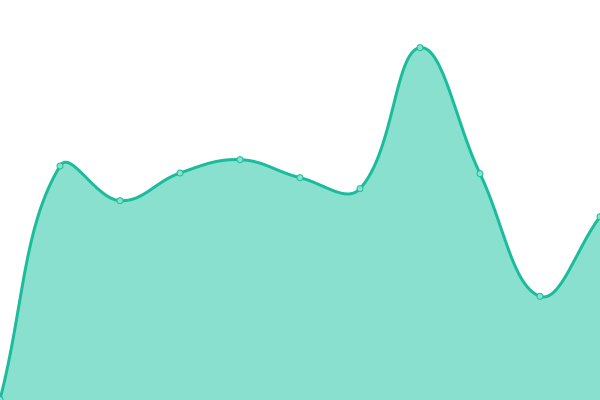
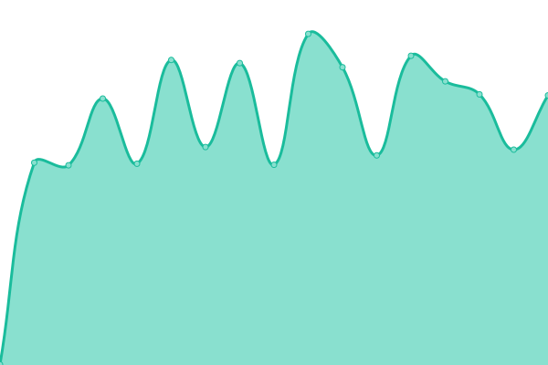
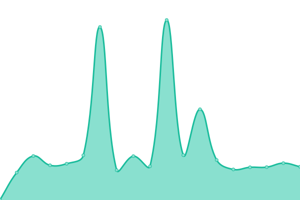

# [📈 Live Status](https://xnaas.github.io/bibliogram-instances): <!--live status--> **🟧 Partial outage**

This repository contains the open-source uptime monitor and status page for [xnaas](https://xnaas.info/), powered by [Upptime](https://github.com/upptime/upptime).

With [Upptime](https://upptime.js.org), you can get your own unlimited and free uptime monitor and status page, powered entirely by a GitHub repository. We use [Issues](https://github.com/xnaas/bibliogram-instances/issues) as incident reports, [Actions](https://github.com/xnaas/bibliogram-instances/actions) as uptime monitors, and [Pages](https://xnaas.github.io/bibliogram-instances) for the status page.

<!--start: status pages-->
<!-- This summary is generated by Upptime (https://github.com/upptime/upptime) -->
<!-- Do not edit this manually, your changes will be overwritten -->
<!-- prettier-ignore -->
| URL | Status | History | Response Time | Uptime |
| --- | ------ | ------- | ------------- | ------ |
|  [bibliogram.art](https://bibliogram.art) | 🟩 Up | [bibliogram-art.yml](https://github.com/xnaas/bibliogram-instances/commits/HEAD/history/bibliogram-art.yml) | 

 796ms
     
 | 

<a href="https://xnaas.github.io/bibliogram-instances/history/bibliogram-art">100.00%</a>
    

|  [bibliogram.snopyta.org](https://bibliogram.snopyta.org) | 🟩 Up | [bibliogram-snopyta-org.yml](https://github.com/xnaas/bibliogram-instances/commits/HEAD/history/bibliogram-snopyta-org.yml) | 

 947ms
     
 | 

<a href="https://xnaas.github.io/bibliogram-instances/history/bibliogram-snopyta-org">95.27%</a>
    

|  [bibliogram.pussthecat.org](https://bibliogram.pussthecat.org) | 🟩 Up | [bibliogram-pussthecat-org.yml](https://github.com/xnaas/bibliogram-instances/commits/HEAD/history/bibliogram-pussthecat-org.yml) | 

 614ms
     
 | 

<a href="https://xnaas.github.io/bibliogram-instances/history/bibliogram-pussthecat-org">100.00%</a>
    

|  [bibliogram.1d4.us](https://bibliogram.1d4.us) | 🟩 Up | [bibliogram-1d4-us.yml](https://github.com/xnaas/bibliogram-instances/commits/HEAD/history/bibliogram-1d4-us.yml) | 

 445ms
     
 | 

<a href="https://xnaas.github.io/bibliogram-instances/history/bibliogram-1d4-us">100.00%</a>
    

|  [insta.trom.tf](https://insta.trom.tf) | 🟥 Down | [insta-trom-tf.yml](https://github.com/xnaas/bibliogram-instances/commits/HEAD/history/insta-trom-tf.yml) | 

 530ms
     
 | 

<a href="https://xnaas.github.io/bibliogram-instances/history/insta-trom-tf">98.89%</a>
    

|  [bibliogram.hamster.dance](https://bibliogram.hamster.dance) | 🟥 Down | [bibliogram-hamster-dance.yml](https://github.com/xnaas/bibliogram-instances/commits/HEAD/history/bibliogram-hamster-dance.yml) | 

 2354ms
     
 | 

<a href="https://xnaas.github.io/bibliogram-instances/history/bibliogram-hamster-dance">99.07%</a>
    

|  [bib.actionsack.com](https://bib.actionsack.com) | 🟩 Up | [bib-actionsack-com.yml](https://github.com/xnaas/bibliogram-instances/commits/HEAD/history/bib-actionsack-com.yml) | 

 268ms
     
 | 

<a href="https://xnaas.github.io/bibliogram-instances/history/bib-actionsack-com">99.51%</a>
    

|  [biblio.alefvanoon.xyz](https://biblio.alefvanoon.xyz) | 🟩 Up | [biblio-alefvanoon-xyz.yml](https://github.com/xnaas/bibliogram-instances/commits/HEAD/history/biblio-alefvanoon-xyz.yml) | 

 487ms
     
 | 

<a href="https://xnaas.github.io/bibliogram-instances/history/biblio-alefvanoon-xyz">100.00%</a>
    

<!--end: status pages-->

[**Visit our status website →**](https://xnaas.github.io/bibliogram-instances)

## 📄 License

- Powered by: [Upptime](https://github.com/upptime/upptime)
- Code: [MIT](./LICENSE) © [xnaas](https://xnaas.info/)
- Data in the `./history` directory: [Open Database License](https://opendatacommons.org/licenses/odbl/1-0/)
